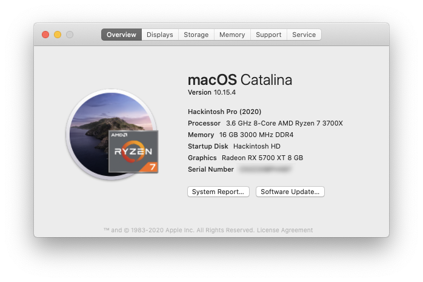
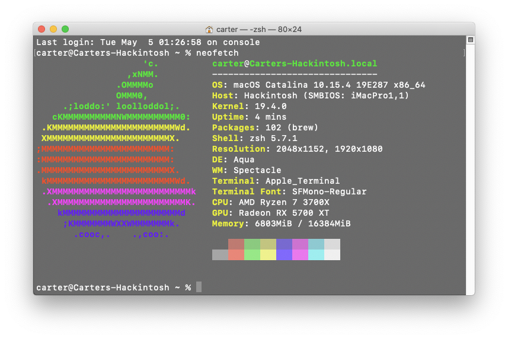

# Hackintosh (2020)
Tracking the progress of my OpenCore Hackintosh build. Currently dual-booting macOS Catalina and Windows 10.

* [`EFI`](EFI/): Copy of current EFI directory from the macOS boot drive
* [`EFI_Install`](EFI_Install/): Copy of EFI directory from the USB drive used during macOS installation

 

## Table of Contents

* [The Build](#the-build)
* [Prepare Install Media](#prepare-install-media)
* [Install OpenCore](#install-opencore)
* [Gather Kexts](#gather-kexts)
* [Configure OpenCore](#configure-opencore)
* [BIOS Settings](#bios-settings-version-f12c)
* [Prepare for macOS Installation](#prepare-for-macos-installation)
* [Install macOS Catalina](#install-macos-catalina)
* [Post Installation](#post-installation)
  * [Make macOS Drive Bootable](#make-macos-drive-bootable)
  * [Enable the Discrete Graphics Card with Headless iGPU](#enable-the-discrete-graphics-card-with-headless-igpu)
  * [Map USB Ports](#map-usb-ports)
  * [Enable Bluetooth](#enable-bluetooth)
  * [Enable FileVault](#enable-filevault)
  * [Enable TRIM for Solid State Drives](#enable-trim-for-solid-state-drives)
  * [Fix CPU Type in About This Mac](#fix-cpu-type-in-about-this-mac)
  * [Fix Memory Tab in About This Mac](#fix-memory-tab-in-about-this-mac)
* [Final BIOS Settings](#final-bios-settings)
* [Final OpenCore Configuration](#final-opencore-configuration)
* [Benchmarks](#benchmarks)
* [Issues](#issues)
* [Upgrade Log](#upgrade-log)
* [References](#references)
* [Resources](#resources)

## The Build

* **CPU:** AMD Ryzen 7 3700X 
* **CPU Cooler:** Cooler Master Hyper 212 EVO (Connected to CPU_FAN)
* **Motherboard:** Gigabyte B450 AORUS PRO WIFI (rev. 1.0)
* **Memory:** G.Skill Trident Z RGB 16 GB DDR4-3000
* **Storage (macOS):** Western Digital Blue 500GB M.2 SSD
* **Storage (Windows):** Samsung 970 Evo 500GB M.2 NVME SSD
* **Video Card:** ASRock Radeon RX 5700 XT 8 GB
* **Power Supply:** Rosewill 550W 80+ Gold
* **Case:** Fractal Design Meshify C
* **Monitor:** MSI Optix MAG241C 23.6" FHD 144Hz FreeSync Monitor
* **Monitor:** AOC CQ27G1 27.0" QHD 144Hz FreeSync Monitor
* **Keyboard:** Logitech G413 Carbon
* **Mouse:** Logitech G502 HERO
* **Network:** PCIe Adapter WiFi Card BCM94360CD

View the build on PCPartPicker: https://pcpartpicker.com/list/nppTDx

## Prepare Install Media

1. Download the [macOS Catalina installer](https://apps.apple.com/us/app/macos-catalina/id1466841314?mt=12) (v10.15.1) from the Mac App Store
2. Open Terminal and format the target USB drive as with the following command:

    `diskutil partitionDisk /dev/{YOUR_DISK_ID} GPT JHFS+ "USB" 100%`
    
3. [Create the bootable macOS installer](https://support.apple.com/sl-si/HT201372): 

    `sudo /Applications/Install\ macOS\ Catalina.app/Contents/Resources/createinstallmedia --volume /Volumes/USB`

4. Once the program finishes, your USB drive should now be called `Install macOS Catalina`

## Install OpenCore

* Download [OpenCore Install Package](https://github.com/Dids/opencore-builder/releases) (v2.5k_r5097) and [OpenCore Configurator Global Edition](http://mackie100projects.altervista.org/download-opencore-configurator/) (v5.7.0.0)
* Install OpenCore to the USB device and customize with the following options:
  * OpenCore for UEFI booting only
  * Install OpenCore in the ESP
  * UEFI Drivers
    * Recommended drivers
      * ApfsDriverLoader
      * HFSPlus
    * Memory fix drivers
      * OsxAptioFix3Drv
    * Additional drivers
      * EmuVariableUefi
 
## Gather Kexts

* [AppleALC.kext](https://github.com/acidanthera/AppleALC/releases) (v1.4.3)
* [IntelMausiEthernet.kext](https://onedrive.live.com/?authkey=%21APjCyRpzoAKp4xs&id=FE4038DA929BFB23%21455134&cid=FE4038DA929BFB23) (v2.5.0)
* [Lilu.kext](https://github.com/acidanthera/Lilu/releases) (v1.3.9)
* [USBInjectAll.kext](https://bitbucket.org/RehabMan/os-x-usb-inject-all/downloads/) (v0.7.1)
* [VirtualSMC.kext](https://github.com/acidanthera/VirtualSMC/releases) (v1.0.9)
  * SMCProcessor.kext
  * SMCSuperIO.kext
* [WhateverGreen.kext](https://github.com/acidanthera/WhateverGreen/releases) (v1.3.4)

1. Use OpenCore Configurator to mount the EFI partition of the USB drive
2. Copy the downloaded .kexts to `EFI/CLOVER/kexts/Other/` on the USB drive EFI partition
3. Copy `VirtualSmc.efi` to `EFI/CLOVER/drivers/UEFI/` on the USB drive EFI partition

The exact kexts and drivers I used during my installation can be found in [`EFI_install/`](EFI_install/).

## Configure OpenCore

The OpenCore configuration for the installation is heavily based upon corpnewt's [r/Hackintosh Vanilla Desktop Guide](https://hackintosh.gitbook.io/-r-hackintosh-vanilla-desktop-guide/) for the [Coffee Lake](https://hackintosh.gitbook.io/-r-hackintosh-vanilla-desktop-guide/config.plist-per-hardware/coffee-lake) microarchitecture. The major difference is with how the iGPU is enabled because I encountered difficulties when using device property injections. Each section of the configuration used during installation is documented below. A sanitized version of the config file can be found in [`EFI_install/CLOVER/`](EFI_install/CLOVER/). You will need to use OpenCore Configurator or [`macserial`](https://github.com/acidanthera/MacInfoPkg/releases) to generate a valid serial number and board serial number for the `iMac19,1`  SMBIOS.

<details><summary>ACPI</summary>
  
  
</details>
 
<details><summary>Boot</summary>
  
</details>

<details><summary>Boot Graphics</summary>
  
</details>

<details><summary>CPU</summary>
  
</details>

<details><summary>Devices</summary>
  
  
</details>

<details><summary>Disable Drivers</summary>
  
</details>

<details><summary>GUI</summary>
  
</details>

<details><summary>Graphics</summary>
  
</details>

<details><summary>Kernel and Kext Patches</summary>
  
</details>

<details><summary>Rt Varibles</summary>
  
</details>

<details><summary>SMBIOS</summary>
  
</details>

<details><summary>System Parameters</summary>
  
</details>

## BIOS Settings (Version F12c)

Enter **Advanced Mode** and **Load Optimized Defaults** to reset the default BIOS settings. Modify the following settings:
  
* Tweaker
  * Advanced CPU Settings
    * Vt-d → **Disabled**
  * Extreme Memory Profile (X.M.P.) → **Profile 1**
* Settings
  * Platform Power
    * ErP → **Disabled**
    * Soft-Off by PWR_BTTN → **Delay 4 Sec.**
    * RC6 (Render Standby) → **Enabled**
  * IO Ports
    * Initial Display Output → **IGFX**
    * Internal Graphics → **Enabled**
    * DVMT Pre-Allocated → **32M**
    * DVMT Total Gfx Mem → **256M**
    * Aperture Size → **512MB**
    * Audio Controller → **Enabled**
    * Above 4G Decoding → **Enabled**
    * USB Configuration
      * Legacy USB Support → **Enabled**
      * XHCI Hand-off → **Enabled**
    * Network Stack Configuration
      * Network Stack → **Disabled**
  * Miscellaneous
    * Intel Platform Trust Technology (PTT) → **Disabled**
* Boot
  * Windows 8/10 Features → **Windows 8/10**
  * CSM Support → **Disabled**
* Smart Fan 5 Settings (F6)
  * CPU_FAN (or whichever header was used for the AIO CPU cooler)
    * Speed Control → **Full Speed**
* Save & Exit
  * Choose **Save and Exit** to save BIOS settings and reboot

## Prepare for macOS Installation

1. Connect HDMI cable to the integrated graphics output on the motherboard
2. Insert macOS Installer USB drive into the USB 3.0 port adjacent to Ethernet connector
3. Connect keyboard and mouse to USB 2.0 ports


## Install macOS Catalina

1. Restart computer and select the USB drive as the default BIOS boot device 
2. Select `Install macOS Catalina` as the OpenCore boot volume 
3. Launch Disk Utility and format the destination drive (Samsung 970 Evo)
    * Name: `Macintosh SSD`
    * Format: `Mac OS Extended (Journaled)` or `APFS` (will be reformatted as `APFS` during installation)
    * Scheme: `GUID Partition Map`
2. Launch Install macOS and select the `Macintosh SSD` drive as the destination 
    * As the system restarts, keep selecting `Boot macOS Install from Macintosh SSD` from the OpenCore menu
    * If the system freezes, use the power button to shut down the computer and turn off the power supply. Wait a few minutes before restarting to continue the installation process.
4. Once the installation is complete, select `Boot macOS from Macintosh SSD` from the OpenCore menu
    * Proceed through the normal macOS setup but delay signing into iCloud until post installation is complete
    
## Post Installation

### Make macOS Drive Bootable

1. Mount the EFI partition of `Macintosh SSD` and copy over the entire EFI directory from the USB drive
2. Restart the computer and select the internal drive (Samsung 970 Evo) as the default BIOS boot device
3. Select `Boot macOS from Macintosh SSD` from the OpenCore menu
4. You should now have a bootable macOS installation!

_Note: You can now remove the USB drive but keep it handy for debugging issues with your Hackintosh._

### Enable the Discrete Graphics Card with Headless iGPU

1. Modify the OpenCore configuration on the EFI partition of `Macintosh SSD`
    * Boot
      * Remove the `-wegnoegpu` boot argument
      * Add the `agdpmod=pikera` boot argument
    * Devices
      * Clear value of `IntelGFX` field
      * Add new device: `PciRoot(0x0)/Pci(0x2,0x0)`
          * Add property: `AAPL,ig-platform-id` - `0300983E` - `DATA`
      
    * Graphics
      * Uncheck `Inject Intel`
2. Reboot the computer and modify the following BIOS settings:
    * Settings
      * IO Ports
        * Initial Display Output → **PCIe 1 Slot**
        * Internal Graphics → **Enabled**
        * DVMT Pre-Allocated → **64M**
        * DVMT Total Gfx Mem → **256M**
3. Save the changes and reboot the computer
4. Disconnect the HDMI cable from the motherboard and connect a DisplayPort cable to the graphics card
5. You should now be using the natively-supported discrete graphics card (as of macOS 10.15.1) to power your display(s) in conjunction with the headless iGPU for compute tasks.
    * [Hackintool](https://www.insanelymac.com/forum/topic/335018-hackintool-v286/) can be used to verify the availability of the iGPU for hardware decoding under the `VDA Decoder` system parameter. 


_Note: You should also make these changes to your USB drive OpenCore configuration so that it can properly boot your system if the `Macintosh SSD` EFI partition gets messed up. If you don't update the configuration, you'll have to swap back to using the integrated graphics instead of the discrete graphics card._

### Map USB Ports

Apple's USB driver implementation restricts macOS to only 15 HS/SS ports. During the installation process, we utilized RehabMan's [USBInjectAll](https://github.com/RehabMan/OS-X-USB-Inject-All) kext and USB port limit kext patches to `com.apple.iokit.IOUSBHostFamily` and `com.apple.driver.usb.AppleUSBXHCI` to circumvent this restriction. While useful during installation, it is generally recommended that these workarounds be removed in favor of a custom SSDT or port injector kext for the final system configuration to avoid buffer overruns and sleep/wake issues. In order to map out the custom port injection for the system, we will be using corpnewt's [USBMap](https://github.com/corpnewt/USBMap) Python script and following along with the process described in [Carl Mercier's YouTube video](https://www.youtube.com/watch?v=j3V7szXZZTc).

_If you have the Gigabyte Z390 AORUS PRO WIFI motherboard and want the same USB port mapping I utilize, you can download my [`USBMap.kext`](EFI/CLOVER/kexts/Other/USBMap.kext), [`SSDT-USBX.aml`](EFI/CLOVER/ACPI/patched/SSDT-USBX.aml), and [`SSDT-USBX.dsl`](EFI/CLOVER/ACPI/patched/SSDT-USBX.dsl) and skip to Step 5._

1. Add the `change EHC1 to EH01` and `change EHC2 to EH02` patches to the ACPI OpenCore configuration on the EFI partition of `Macintosh SSD` and reboot

    
    
2. Open Terminal and run the following commands to download and execute the USBMap script:
    ```
    git clone https://github.com/corpnewt/USBMap
    cd USBMap
    chmod +x USBMap.command
    ./USBMap.command
    ```
3. Press `d` then `[enter]` to begin the port discovery process. Using a USB device (e.g. flash drive), systematically test each external USB port to identify its corresponding ID. The complete USB port layout for the Gigabyte Z390 AORUS PRO WIFI motherboard is detailed in the image below. Once the desired ports have been identified, press `q` then `[enter]` to return to the main menu. 

    

4. Press `p` then `[enter]` to begin creating the custom port mapping kext
    1. Press `a` then `[enter]` to enable all ports
    2. Using the list of identified ports, enter the numbers of the ports you want to **disable**
        * No more than 15 XHC ports can be enabled
        * `2,3,4,5,9,11,12,15,16,18,25` → `HS02,HS03,HS04,HS05,HS09,HS11,HS12,USR1,USR2,SS02,SS09`
          * Disables AIO control via the internal header and USB 2.0 for three rear Type-A ports
          * If you don't need Bluetooth, you can disable `HS14` and enable one of the disabled USB 2.0 ports
        * The **enabled ports are red** and the **disabled ports are gray** in the image above
    3. Press `k` then `[enter]` to build the custom USBMap.kext file
    4. Allow the program to move the files to your EFI partition or copy them manually:
        * `USBMap.kext` → [`EFI/CLOVER/kexts/Other/`](EFI/CLOVER/kexts/Other/)
        * `SSDT-USBX.aml` → [`EFI/CLOVER/ACPI/patched/`](EFI/CLOVER/ACPI/patched/)
        * `SSDT-USBX.dsl` → [`EFI/CLOVER/ACPI/patched/`](EFI/CLOVER/ACPI/patched/)
5. Modify the OpenCore configuration on the EFI partition of `Macintosh SSD`
    * ACPI
      * Remove the `change EHC2 to EH02` patch (not present on this system)
    * Kernel and Kext Patches
      * Remove the `com.apple.iokit.IOUSBHostFamily` kext patch
      * Remove the `com.apple.driver.usb.AppleUSBXHCI` kext patch
6. Delete the `USBInjectAll.kext` from `EFI/CLOVER/kexts/Other/` on the EFI partition of `Macintosh SSD`
7. You should now have fully custom-mapped USB ports on your system! Use the USBMap script after a reboot to verify the correct ports are enabled.

### Enable Bluetooth

The Intel CNVi modules that provide integrated Wi-Fi and Bluetooth functionality on motherboards are not natively supported by macOS but can be enabled using the [IntelBluetoothFirmware](https://github.com/zxystd/IntelBluetoothFirmware) kext on supported devices. The Gigabyte Z390 AORUS PRO WIFI contains a compatible [Intel Wireless-AC 9560](https://www.intel.com/content/www/us/en/products/wireless/wireless-products/dual-band-wireless-ac-9560.html) CNVi (Vendor ID: `0x8087`, Device ID: `0x0AAA`). [Hackintool](https://www.insanelymac.com/forum/topic/335018-hackintool-v286/) can be used to determine the specific model on your motherboard (`System > Peripherals > Bluetooth`).
  * _Note: You must enable the internal USB port used by the CNVi module during the [USB mapping process](#map-usb-ports)._

Download the [latest release](https://github.com/zxystd/IntelBluetoothFirmware/releases) and place the two kexts in [`EFI/CLOVER/kexts/Other/`](EFI/CLOVER/kexts/Other/). Reboot and you should be able to use Bluetooth on your Hackintosh.


### Enable FileVault

[FileVault](https://support.apple.com/en-us/HT204837) is used to encrypt the startup disk on your Hackintosh. Enabling it is entirely optional but probably a good idea for the security conscious, especially if you are building a portable system. Before turning on the feature, you will need to make sure you have several drivers installed to allow OpenCore to interact with the encrypted drive. These instructions are based on the advice from [this tonymacx86 comment](https://www.tonymacx86.com/threads/filevault2-boot-issues-with-opencore-under-macos-catalina.285697/#post-2021159) and [this vanilla laptop guide](https://fewtarius.gitbook.io/laptopguide/extras/enabling-filevault).

1. If present, **remove** any of the following outdated OpenCore-installed FileVault 2 UEFI drivers:
    * `AppleImageCodec.efi`
    * `AppleKeyAggregator.efi`
    * `AppleKeyFeeder.efi`
    * `AppleUITheme.efi`
    * `FirmwareVolume.efi`
    * `HashServiceFix.efi`
2. Download [AppleSupportPkg v2.0.9](https://github.com/acidanthera/AppleSupportPkg/releases/tag/2.0.9) and copy the following two drivers to `EFI/CLOVER/drivers/UEFI/`:
    * `AppleGenericInput.efi`
    * `AppleUiSupport.efi`
3. Modify the OpenCore configuration on the EFI partition of `Macintosh SSD`
    * Boot
      * Default Boot Volume  →  `Preboot`
    * GUI
      * Remove `Preboot` from hidden volumes (if present)
4. Open System Preferences > Security & Privacy and navigate to the FileVault tab
    * Click `Turn On FileVault` and select an option for setting the recovery key
    * Wait for encrypting to complete
    
    
    
5. Restart your system, which should now default to the `FileVault Preboot from Preboot` option, and enter your password at login to decrypt the system drive.

_Note: You should also make these changes to your USB drive OpenCore configuration so that it can properly boot your system if the `Macintosh SSD` EFI partition gets messed up. If you don't update the configuration, then the OpenCore bootloader will not be able to properly handle the FileVault-encrypted drive._

### Enable TRIM for Solid State Drives

1. Open Terminal and enter the following command:

    `sudo trimforce enable`
    
2. Verify TRIM was enabled in System Report:

    

### Fix CPU Type in About This Mac

For some reason, About This Mac and System Report do not properly identify the processor and list it as an 'Intel Core i9' instead of an 'Intel Core i7.' This can easily be fixed by using OpenCore Configurator to set the CPU Type to `0x0705` and rebooting.


### Fix Memory Tab in About This Mac

The default `iMac19,1` SMBIOS configuration used in this build sets `PlatformFeature=0x22`, which indicates that the system lacks user-upgradable memory and therefore hides the Memory tab on About This Mac (as seen above) and any empty memory slots in the System Report. This can easily be fixed by using OpenCore Configurator to set `PlatformFeature=0x20` in the `SMBIOS` section and rebooting.


### Hide Windows Drive in macOS
    
Follow [these instructions](https://discussions.apple.com/docs/DOC-7942) to prevent the Windows drive from automatically mounting in macOS:

1. Open Terminal and enter the following command to get the `Volume UUID`:
      
    `diskutil info /Volumes/{YOUR_WINDOWS_DRIVE_NAME}`
          
2. Enter `sudo vifs` to add the following line to `/etc/fstab`:
      
    `UUID={YOUR_UUID} none ntfs rw,noauto`
      
3. Restart your system and the Windows partition will no longer automatically mount.


## Final BIOS Settings

Screenshots of my current BIOS settings on my working (i.e. stable) system. 

<details><summary>Tweaker</summary>
  

  Advanced CPU Settings
  

  Advanced Memory Settings
  

</details>
  
<details><summary>Settings</summary>

  Platform Power
  

  IO Ports
  

  USB Configuration
  

  SATA and RST Configuration
  

  Miscellaneous
  

</details>

<details><summary>Boot</summary>
  
</details>

<details><summary>Smart Fan 5 Settings</summary>
  
</details>


## Final OpenCore Configuration

A sanitized version of my final config file can be found in [`EFI/CLOVER/`](EFI/CLOVER/). Each section of the configuration in OpenCore Configurator is also documented below.

<details><summary>ACPI</summary>
  
  
</details>
 
<details><summary>Boot</summary>
  
</details>

<details><summary>Boot Graphics</summary>
  
</details>

<details><summary>CPU</summary>
  
</details>

<details><summary>Devices</summary>
  
  
</details>

<details><summary>Disable Drivers</summary>
  
</details>

<details><summary>GUI</summary>
  
</details>

<details><summary>Graphics</summary>
  
</details>

<details><summary>Kernel and Kext Patches</summary>
  
</details>

<details><summary>Rt Varibles</summary>
  
</details>

<details><summary>SMBIOS</summary>
  
</details>

<details><summary>System Parameters</summary>
  
</details>

## Benchmarks

_All values are the average of three runs_

* [Geekbench 5](https://www.geekbench.com/)
  * Single Core: 1313.7
  * Multicore: 8055.3
  * OpenCL: 43650.3
  * Metal: 38985.0
* [LuxMark LuxBall](http://www.luxmark.info/): 27424.3
* [BruceX](https://blog.alex4d.com/2013/10/30/brucex-a-new-fcpx-benchmark/): 6.64 seconds
* [Cinebench R20](https://www.maxon.net/en-us/products/cinebench-r20-overview/): 3934
* [Blackmagic Disk Speed Test](https://apps.apple.com/us/app/blackmagic-disk-speed-test/id425264550) (Samsung 970 Evo)
  * Read: 2990.4 MB/s
  * Write: 2484.2 MB/s

## Issues

[See the GitHub repository issues tracker](https://github.com/shiruken/hackintosh/issues)

## Upgrade Log

* 2020-04-20: Upgraded BIOS to version [F12c](https://www.gigabyte.com/us/Motherboard/Z390-AORUS-PRO-WIFI-rev-10/support#support-dl-bios). See updated [BIOS Settings](#bios-settings-version-f12c) section.
* 2020-04-19: Enabled integrated Bluetooth functionality using [IntelBluetoothFirmware 1.0.3](https://github.com/zxystd/IntelBluetoothFirmware/releases/tag/1.0.3). See the [Enable Bluetooth](#enable-bluetooth) section.
* 2020-04-17: Upgraded to [OpenCore Configurator v5.10.0.0](http://mackie100projects.altervista.org/download-opencore-configurator/), [OpenCore v5.0 r5112](https://github.com/OpenCoreHackyColor/OpenCoreBootloader/releases/tag/5112), [AppleALC 1.4.8](https://github.com/acidanthera/AppleALC/releases/tag/1.4.8), [Lilu 1.4.3](https://github.com/acidanthera/Lilu/releases/tag/1.4.3), [WhateverGreen 1.3.8](https://github.com/acidanthera/WhateverGreen/releases/tag/1.3.8), and [Virtual SMC 1.1.2](https://github.com/acidanthera/VirtualSMC/releases/tag/1.1.2). Upgraded to [macOS 10.15.4]() via Software Update (Note: Requires at minimum [OpenCore v2.5k-5104](https://github.com/OpenCoreHackyColor/OpenCoreBootloader/releases/tag/5104)).
* 2020-02-01: Upgraded to [OpenCore Configurator v5.9.2.1](http://mackie100projects.altervista.org/download-opencore-configurator/), [OpenCore v2.5k_r5103](https://github.com/Dids/opencore-builder/releases/tag/v2.5k_r5103), [AppleALC 1.4.5](https://github.com/acidanthera/AppleALC/releases/tag/1.4.5), [Lilu 1.4.1](https://github.com/acidanthera/Lilu/releases/tag/1.4.1), [WhateverGreen 1.3.6](https://github.com/acidanthera/WhateverGreen/releases/tag/1.3.6), and [Virtual SMC 1.1.0](https://github.com/acidanthera/VirtualSMC/releases/tag/1.1.0). Upgraded to [macOS 10.15.3](https://support.apple.com/kb/DL2029) via Software Update.
* 2019-12-18: Upgraded to [macOS 10.15.2](https://support.apple.com/kb/DL2025) via Software Update
* 2019-12-17: Upgraded to [OpenCore Configurator v5.9.0.0](http://mackie100projects.altervista.org/download-opencore-configurator/) and [OpenCore v2.5k_r5100](https://github.com/Dids/opencore-builder/releases/tag/v2.5k_r5100)
* 2019-12-06: Upgraded kexts to [AppleALC 1.4.4](https://github.com/acidanthera/AppleALC/releases/tag/1.4.4), [Lilu 1.4.0](https://github.com/acidanthera/Lilu/releases/tag/1.4.0), [WhateverGreen 1.3.5](https://github.com/acidanthera/WhateverGreen/releases/tag/1.3.5)
* 2019-11-21: Upgraded to [OpenCore v2.5k_r5099](https://github.com/Dids/opencore-builder/releases/tag/v2.5k_r5099)

## References

* [u/corpnewt's r/Hackintosh Vanilla Desktop Guide](https://hackintosh.gitbook.io/-r-hackintosh-vanilla-desktop-guide/)
* [An iDiot's Guide To Lilu and its Plug-ins](https://www.tonymacx86.com/threads/an-idiots-guide-to-lilu-and-its-plug-ins.260063/)
* [[Guide] Intel Framebuffer patching using WhateverGreen](https://www.tonymacx86.com/threads/guide-intel-framebuffer-patching-using-whatevergreen.256490/)
* [Glasgood's macOS Mojave [SUCCESS][GUIDE] for Aorus Z390 Pro](https://www.insanelymac.com/forum/topic/337837-glasgoods-macos-mojave-successguide-for-aorus-z390-pro/)
* [[SUCCESS] Gigabyte Designare Z390 (Thunderbolt 3) + i7-9700K + AMD RX 580](https://www.tonymacx86.com/threads/success-gigabyte-designare-z390-thunderbolt-3-i7-9700k-amd-rx-580.267551/)
* [General Z390 Catalina Guide, or why you should take the time to set things from scratch (bonus 5700 XT guide)](https://www.reddit.com/r/hackintosh/comments/dpu4by/general_z390_catalina_guide_or_why_you_should/)
* [How to fix USB 3 ports on a Hackintosh by generating your own SSDT or USBMap.kext](https://www.youtube.com/watch?v=j3V7szXZZTc)
* [FileVault2 boot issues with OpenCore under macOS Catalina](https://www.tonymacx86.com/threads/filevault2-boot-issues-with-opencore-under-macos-catalina.285697/#post-2021159)
* [Enabling FileVault - The Vanilla Laptop Guide](https://fewtarius.gitbook.io/laptopguide/extras/enabling-filevault)
* [[Solved] OpenCore shows two boot options for Windows EFI](https://www.tonymacx86.com/threads/solved-opencore-shows-two-boot-options-for-windows-efi.243457/)
* [Prevent a volume from mounting at startup](https://discussions.apple.com/docs/DOC-7942)

## Resources

* [OpenCore Configurator Global Edition](http://mackie100projects.altervista.org/download-opencore-configurator/)
* [OpenCore Theme Manager](https://www.insanelymac.com/forum/topic/302674-opencore-theme-manager/)
* [Hackintool](https://www.insanelymac.com/forum/topic/335018-hackintool-v286/)
* [MacInfoPkg (macserial)](https://github.com/acidanthera/MacInfoPkg)
* [USBMap](https://github.com/corpnewt/USBMap)
